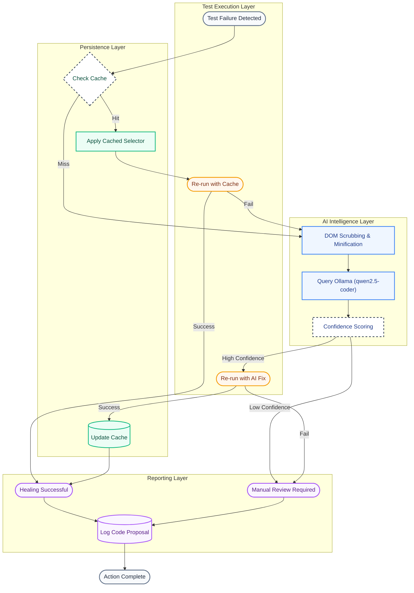

# Healix

[](https://pypi.org/project/healix-ai/)
[](https://pypi.org/project/healix-ai/)
[](LICENSE)
[](https://github.com/kunaal-ai/healix/actions/workflows/ci.yml)

**Healix** is a **privacy-first**, self-healing web automation agent. It fixes broken Playwright selectors using AI — and everything runs **100% on your machine**. No data ever leaves your device.

> Built for teams in **healthcare, fintech, government, and enterprise** where sending DOM data to cloud APIs is not an option.

## The Problem

Web automation is fragile. Selectors break when:
- Developers change class names
- DOM structure shifts
- Content loads dynamically
- A/B tests alter page layouts

## Why Healix?

- **Zero data exposure** — AI runs locally via Ollama. No API keys, no cloud, no telemetry. Your DOM never leaves `localhost`
- **Compliance ready** — Safe for HIPAA, SOC 2, PCI-DSS, and air-gapped environments
- **Zero config** — Drop-in replacement for flaky selectors, no test rewrites needed
- **Browser-aware** — Separate caching per browser engine (Chromium, Firefox, WebKit)
- **Learns over time** — Caches successful fixes for instant replay on subsequent runs
- **Transparent** — Logs every decision with confidence scores and reasoning

## The Solution

Healix uses an **agentic loop** to automatically detect and fix selector failures:

1. **Observe** — Analyze the current page state and DOM
2. **Reason** — Use AI to determine the correct selector/action
3. **Act** — Execute the corrected action
4. **Verify** — Confirm the action succeeded
5. **Learn** — Cache successful fixes for future use

### Operational Workflow



## Architecture

```
healix/
├── .github/                   # CI/CD workflows
│   └── workflows/
│       └── main.yml           # Automated test runs
├── src/                       # Source code for the library
│   └── healix/
│       ├── __init__.py        # Makes it a package
│       ├── engine.py          # The core Healix class
│       └── utilities/         # Helper functions
│           ├── __init__.py
│           └── dom_scrubber.py # BeautifulSoup logic
├── tests/                     # Test suites to verify Healix
│   ├── integration/
│   │   └── test_login.py      # Demo test case
│   └── unit/
│       └── test_engine.py     # Testing the AI logic/cleaner
├── data/                      # Local data storage
│   └── healix_cache.json      # Persistent cache for fixes
├── docker/                    # Containerized environments
│   └── Dockerfile
├── .gitignore                 # Ignore __pycache__ and local config
├── requirements.txt           # Dependencies
└── README.md                  # This file
```

## Prerequisites

- **Python** 3.9 or higher
- **Ollama** running locally — [Install Ollama](https://ollama.com/download), then:
  ```bash
  ollama serve
  ollama pull qwen2.5-coder:7b
  ```

## Installation

```bash
pip install healix-ai
```

Or install from source:

```bash
git clone https://github.com/kunaal-ai/healix.git
cd healix
pip install -e .
```

Make sure to install Playwright browsers:

```bash
playwright install chromium
```

## Quick Start

```python
import asyncio
from playwright.async_api import async_playwright
from healix import smart_click

async def test_healix_agent():
    async with async_playwright() as p:
        browser = await p.chromium.launch(headless=False)
        page = await browser.new_page()
        
        await page.goto("https://example.com")
        
        # Healix will automatically fix broken selectors
        await smart_click(page, "#broken-selector")
        
        await browser.close()

if __name__ == "__main__":
    asyncio.run(test_healix_agent())
```

## How It Works

### DOM Cleaning & Privacy
- Strips scripts, styles, and heavy elements to save tokens
- Focuses on actionable elements (buttons, links, inputs)
- All processing happens in-memory on your machine

### AI-Powered Reasoning
- Uses local LLM (Ollama) for selector analysis — **no external API calls**
- Considers both technical errors and visible page state
- Returns confidence scores and explanations

### Persistent Learning
- Caches successful fixes in `~/.healix/cache.json`
- Gets faster over time as it learns common patterns
- Maintains context across test runs

## Privacy & Security

Healix was designed from the ground up for **zero-data-exposure** environments:

| What | Where it runs | Data leaves device? |
|------|:------------:|:---:|
| AI inference (Ollama) | `localhost:11434` | No |
| DOM analysis | In-process Python | No |
| Selector cache | `~/.healix/` | No |
| Browser automation | Local Playwright | No |

- **No cloud APIs** — The LLM runs entirely on your hardware via Ollama
- **No telemetry** — Healix collects zero analytics or usage data
- **No network calls** — The only outbound traffic is your test navigating to its target URL
- **No API keys** — Nothing to configure, nothing to leak

This makes Healix safe for:
- **Healthcare** (HIPAA) — Patient portals, EHR systems
- **Finance** (SOC 2, PCI-DSS) — Banking apps, payment flows
- **Government** (FedRAMP) — Internal tools, classified environments
- **Enterprise** — Any org that prohibits sending DOM/HTML to third-party APIs

## Configuration

Healix uses Ollama for local AI inference:

```python
from healix import Healix

# Default model: qwen2.5-coder:7b
healix = Healix(model="your-preferred-model")
```

Make sure Ollama is running:
```bash
ollama serve
```

## Testing

```bash
# Run all tests
pytest tests/

# Run with coverage
pytest tests/ --cov=src/healix --cov-report=html

# Run integration tests (requires browser)
pytest tests/integration/
```

## Docker Support

```bash
# Build the container
docker build -t healix .

# Run tests in container
docker run healix
```

## Contributing

1. Fork the repository
2. Create a feature branch
3. Add tests for new functionality
4. Ensure all tests pass
5. Submit a pull request

## License

This project is licensed under the [MIT License](LICENSE).

## Known Limitations

- Requires Ollama running locally (cloud LLM support planned)
- Healing accuracy depends on DOM quality — heavily obfuscated pages may need multiple retries
- First-time healing adds latency (~2-5s per selector); cached fixes are instant
- Currently supports `click` and `fill` actions; other Playwright actions coming soon

## Support

- **Issues**: [github.com/kunaal-ai/healix/issues](https://github.com/kunaal-ai/healix/issues)
- **Changelog**: See [Releases](https://github.com/kunaal-ai/healix/releases)

## Roadmap

- [ ] Support for more AI models (OpenAI, Anthropic)
- [ ] Visual regression testing
- [ ] Multi-browser support expansion
- [ ] Performance optimization for large-scale testing
- [ ] Plugin system for custom healing strategies